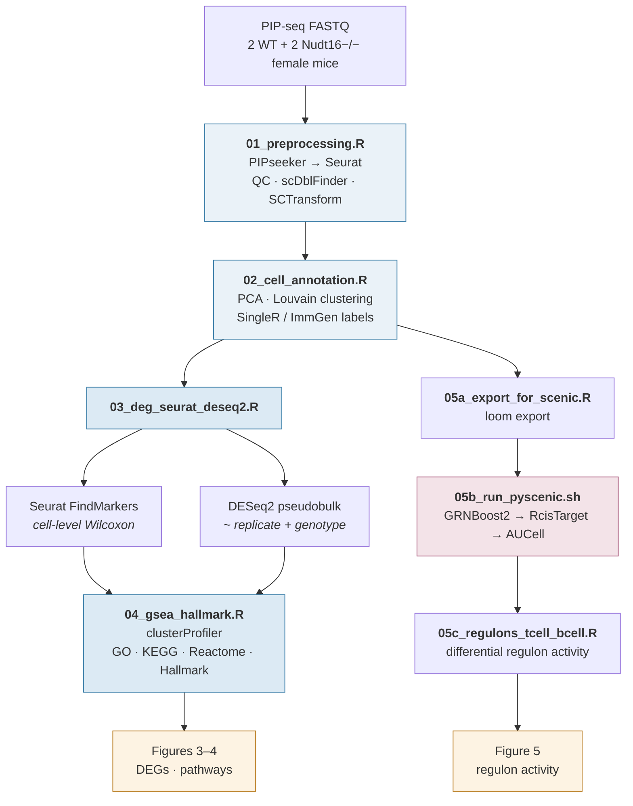

# Nudt16-Single-Cell-Analysis

Single-cell RNA-seq analysis of spleen from Nudt16 knockout and wild-type mice.
This repository contains the analysis workflow for "Single-cell transcriptomics of Nudt16-deficient mouse spleen identifies coordinated alterations in DNA damage response and immune homeostasis."

**Data:** GEO accession `GSE344031` 
**Preprint/paper:** `DOI pending` 
**Contact:** [@megbudankayala](https://github.com/megbudankayala)

---

## Analysis flow



---

## Repository contents

| Script | Stage | What it does |
| --- | --- | --- |
| `00_config.R` | setup | Paths, sample sheet, thresholds, colour palette. **Edit this first.** |
| `01_preprocessing.R` | QC | Reads PIPseeker matrices, filters cells on nFeature/nCount/percent.mt, removes doublets with scDblFinder, normalises with SCTransform |
| `02_cell_annotation.R` | annotation | PCA, neighbour graph, Louvain clustering, UMAP, SingleR labelling against ImmGen |
| `03_deg_seurat_deseq2.R` | DE | Two independent tests: Seurat `FindMarkers` on cells, and DESeq2 on pseudobulk counts with `~ replicate + genotype` |
| `04_gsea_hallmark.R` | enrichment | clusterProfiler over-representation analysis: GO BP/CC/MF, KEGG, Reactome, MSigDB Hallmark |
| `05a_export_for_scenic.R` | GRN | Exports the expression matrix as `.loom` for pySCENIC |
| `05b_run_pyscenic.sh` | GRN | GRNBoost2 → RcisTarget (motif pruning) → AUCell regulon scoring |
| `05c_regulons_tcell_bcell.R` | GRN | Differential regulon activity between genotypes within T and B cells |
| `MASTER_NUDT16_FEMALES.R` | — | Full analysis as originally run, kept for provenance |
| `preprocessfinal.R` | — | Preprocessing as originally run, kept for provenance |
| `run_all.R` | driver | Sources `00`–`05c` in order |

---

## Quick start

```bash
git clone https://github.com/megbudankayala/Nudt16-Single-Cell-Analysis.git
cd Nudt16-Single-Cell-Analysis
```

Open `00_config.R` and set the input and output paths, then:

```r
source("run_all.R")
```

The pySCENIC step runs outside R:

```bash
bash 05b_run_pyscenic.sh
```

Runtime is dominated by GRNBoost2; the R stages complete in well under an hour
on a standard workstation. <!-- TODO: replace with your measured runtime and RAM -->

---

## Requirements

**R ≥ 4.3** with Seurat v5, scDblFinder, SingleR, celldex, DESeq2, clusterProfiler,
org.Mm.eg.db, msigdbr, tidyverse.

```r
install.packages(c("Seurat", "tidyverse"))
BiocManager::install(c("scDblFinder", "SingleR", "celldex", "DESeq2",
                       "clusterProfiler", "org.Mm.eg.db"))
```

**Python ≥ 3.9** with pySCENIC for the regulon analysis.

```bash
pip install pyscenic
```

`05b_run_pyscenic.sh` needs the mouse cisTarget databases (`mm10` feather
files) and the motif annotation table from the
[SCENIC resources](https://resources.aertslab.org/cistarget/).


---

## Data availability

Raw FASTQ and processed count matrices are deposited in NCBI GEO under accession
`GSE344031`. The scripts expect the PIPseeker `barcodes.tsv` / `features.tsv` /
`matrix.mtx` triplets; point `00_config.R` at directory. 


---

## Reproducing the figures

Each script writes its tables to `results/` and its panels to `figures/`.
The manuscript figures map to stages as follows:

- **Figure 3** — *Nudt16* expression, UMAP, DESeq2 volcano, and pathway enrichment (`03`, `04`)
- **Figure 4** — DNA-damage/repair and immune gene panels (`03`, `04`)
- **Figure 5** — regulon activity in T and B cells (`05a`–`05c`)


---

## Notes on interpretation
The cell-level Wilcoxon test in Seurat and the pseudobulk DESeq2 test answer
different questions and do not always agree in direction. DESeq2 on pseudobulk is the inferentially appropriate test, cell-level statistics are
reported as descriptive.


---

## Citation

Please cite:

> Wang, Budankayala M., Samsa, Xie, Gong. *Single-cell transcriptomics of
> Nudt16-deficient mouse spleen identifies coordinated alterations in DNA damage
> response and immune homeostasis.* <!-- TODO: journal, year, DOI -->

---

## License

<!-- TODO: pick one. MIT is the usual choice for academic analysis code and
     lets others reuse it with attribution. Add a LICENSE file to match. -->
